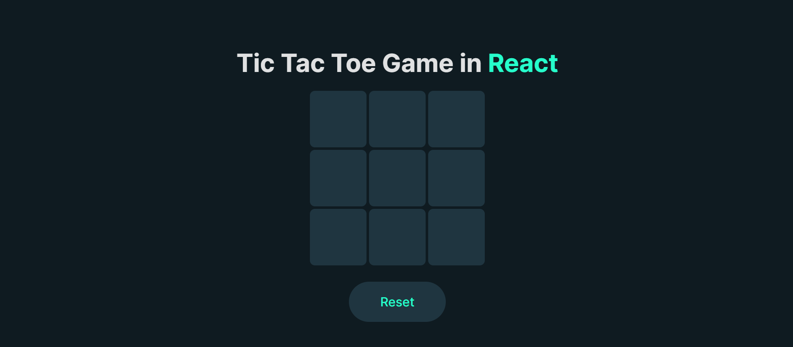

# Tic Tac Toe
 
## A simple `Tic Tac Toe` game, using reactjs.

### You can  easily `download` this repo by going to the `code button`, after pressing it click on `Download zip`.

### After `Downloading` it, open in `VS-code`, and run the `npm run dev` command in the terminal, and copy or manually type `(http://localhost:5173/)` your project start working.

### Here is some representation of my `Tic Tac Toe` project.

